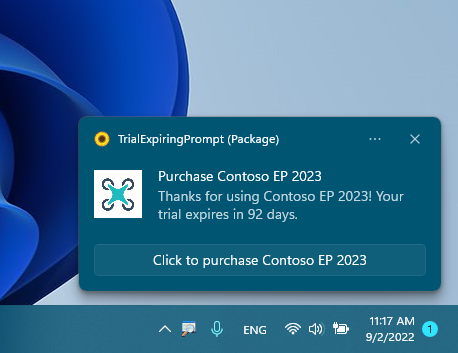
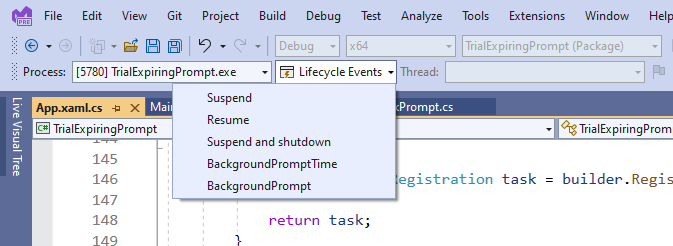

# Sample:  Microsoft Store App - Trial Expiring Notification

## Introduction
If you're using a time-bound free trail when publishing your apps, you may want to periodically prompt your user to purchase the app - especially as it gets closer to the expiration date.



## Prompt the user even if the app is not running using a Background Task

This WinUI 3 Desktop Packaged sample detects if the user is in Trial mode and if so, periodically prompts the user to purchase using a toast notification. When the user selects 'Click to purchase', they are prompted to purchase the app.

To not be dependent on the app running, a background task is used to prompt the user every four hours while the app is in ```Trial``` mode.

## Sample Components

This sample includes the following projects:

- **BackgroundPrompt**: This is a C#/WinRT component with an example background task that pops a toast notification. This is based on this sample: [https://github.com/microsoft/CsWinRT/tree/master/src/Samples/BgTaskComponent](https://github.com/microsoft/CsWinRT/tree/master/src/Samples/BgTaskComponent).

- **TrialExpiringPrompt** and **TrialExpiringPrompt (Package)**: These projects demonstrate hosting the background task component in a packaged ```.NET 6``` / ```Windows App SDK application```. This is the main app and does the following:
  1) Registers the background task. If the app is not in trial mode, the background task is unregistered. (```App::OnLaunched()``` and ```App::RegisterBackgroundTaskPrompt```)
  3) Determines if the app is in Trial mode (```App::IsAppTrial()```) and how long before the trial expires.
  4) Handles the user selecting 'Click to purchase' in the toast notification and launching the Microsoft Store app deep linking the the app's product description page. (```App::ToastNotificationManagerCompat_OnActivated()```)

  - **TrialExpiringPrompt** has a project reference to **BackgroundPrompt**.

  - **TrialExpiringPrompt (Package)** is a packaging app with a reference to **TrialExpiringPrompt**. The packaging app is required for hosting out-of-process WinRT components.

## Prerequisites

* [.NET 6](https://dotnet.microsoft.com/download/dotnet/6.0)
* [Windows App SDK](https://docs.microsoft.com/en-us/windows/apps/windows-app-sdk/set-up-your-development-environment?tabs=vs-2022-17-1-a%2Cvs-2022-17-1-b)
* Visual Studio 2022

## Build and run the sample

1. Open **TrialExpiringPrompt.sln** in Visual Studio 2022.

2. Ensure that the **TrialExpiringPrompt (Package)** project is set as the startup project.

3. From Visual Studio, choose **Start Debugging** (F5).

### Triggering the background task

The **BackgroundPrompt** background task raises a toast notification and is triggered by a timer event every four hours. For development purposes, the toast notification can be raised by triggering by a TimeZoneChange event. Alternatively, you can invoke the background task while debugging the sample by using the **Lifecycle Events** dropdown in Visual Studio as shown below:



